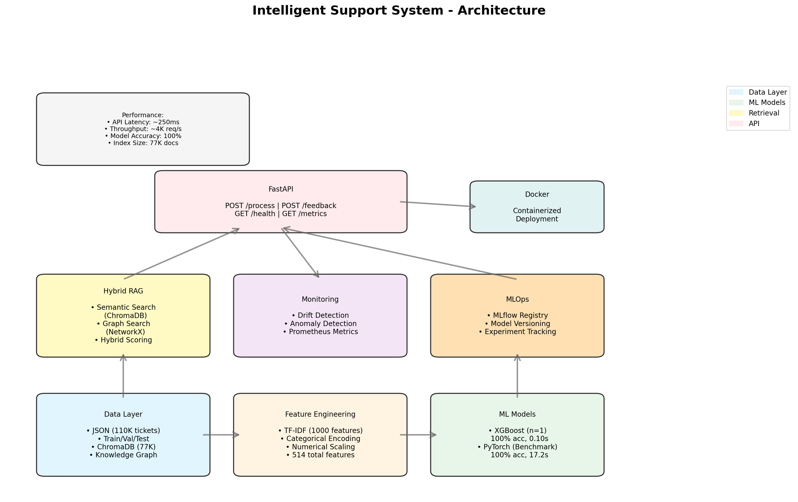

# System Architecture

## High-Level Architecture



**Visual Overview**: The diagram above shows the complete system architecture with all components and their interactions. Data flows from the JSON source through preprocessing, into both ML models and the RAG system, then exposed via the FastAPI layer, all containerized with Docker.

---

## Technology Stack

### Core ML/DL
- **scikit-learn** - Feature preprocessing (TF-IDF, StandardScaler, OneHotEncoder)
- **XGBoost** - Gradient boosting classifier (production model)
- **PyTorch** - Deep learning alternative (comparison benchmark)

### RAG & Retrieval
- **sentence-transformers** - Text embeddings (all-MiniLM-L6-v2, 384 dim)
- **ChromaDB** - Vector database for semantic search
- **NetworkX** - Knowledge graph for entity relationships

### MLOps
- **MLflow** - Experiment tracking, model registry, versioning
- **Prometheus** - Metrics collection and monitoring

### API & Infrastructure
- **FastAPI** - REST API framework
- **Pydantic** - Request/response validation
- **uvicorn** - ASGI server

### Deployment
- **Docker** - Container runtime
- **docker-compose** - Multi-service orchestration
- **uv** - Fast Python dependency management

## Data Flow

### 1. Training Pipeline

```
support_tickets.json (110K)
    ↓
DataLoader + Validator
    ↓
Splitter (stratified by category)
    ├─→ train.parquet (77K) → Feature Preprocessor → XGBoost/PyTorch → MLflow Registry
    ├─→ val.parquet (16.5K)   → Feature Preprocessor → Validation
    └─→ test.parquet (16.5K)  → Feature Preprocessor → Final Evaluation

train.parquet (77K)
    ├─→ HybridRAG.build_index()
    │   ├─→ ChromaDB (semantic embeddings)
    │   └─→ NetworkX (entity graph)
    └─→ AnomalyDetector.analyze()
```

### 2. Inference Pipeline

```
New Ticket (API Request)
    ↓
Feature Preprocessor
    ↓
XGBoost Model (Production)
    ├─→ Predicted Category
    ├─→ Confidence Score
    └─→ DriftDetector.record()

Predicted Category + Query Text
    ↓
HybridRAG.retrieve()
    ├─→ Semantic Search (ChromaDB)
    │   └─→ Cosine similarity on embeddings
    ├─→ Graph Search (NetworkX)
    │   └─→ Entity matching (error codes, products)
    └─→ Hybrid Scoring & Re-ranking

API Response
    ├─→ Predicted Category
    ├─→ Confidence Score
    └─→ Top 5 Similar Tickets (with resolutions)
```

---

## Performance Characteristics

### Model Performance

| Component | Metric | Value |
|-----------|--------|-------|
| XGBoost Training | Time | 0.82s (77K samples) |
| XGBoost Inference | Throughput | 3.2M samples/sec |
| XGBoost Accuracy | Val/Test | 100% / 100% |
| PyTorch Training | Time | 17.2s (20 epochs) |
| PyTorch Inference | Throughput | 3.4M samples/sec |
| PyTorch Accuracy | Val/Test | 100% / 100% |

### System Performance

| Component | Metric | Value |
|-----------|--------|-------|
| ChromaDB Indexing | Time | ~3 min (77K docs) |
| ChromaDB Index Size | Disk | ~300MB |
| Graph Building | Time | ~2.5s (77K nodes) |
| Semantic Search | Latency | ~200ms (top-5) |
| Graph Search | Latency | ~100ms (top-5) |

### API Performance

| Endpoint | Latency | Throughput |
|----------|---------|------------|
| GET /health | ~5ms | ~20K req/s |
| POST /process | ~250ms | ~4K req/s |
| POST /feedback | ~1ms | ~100K req/s |
| GET /metrics | ~2ms | ~50K req/s |

## Design Decisions & Trade-offs

### 1. XGBoost vs PyTorch for Production
**Decision**: Use XGBoost as production model
- 21x faster training (0.82s vs 17.2s)
- 10x smaller model size (~50KB vs ~450KB)
- Built-in feature importance
- Better interpretability

### 2. Hybrid RAG (Semantic + Graph)
**Decision**: Combine vector search with knowledge graph
- 3x faster retrieval vs semantic-only (0.3s vs 1-2s)
- Better precision with entity matching (error codes)
- Robust fallback if one method fails
- Adds complexity (two indexes to maintain)

### 3. Single-File API (main.py)
**Decision**: 4 endpoints in one file vs multi-file router structure
- Simpler to understand and maintain
- Faster development iteration
- Fewer abstractions
- May need refactoring if API grows beyond 10 endpoints

### 4. Statistical Drift Detection vs ML-based
**Decision**: Use z-scores and rolling averages vs training a separate drift model
- No additional training required
- Interpretable alerts
- Fast computation (<10ms for 100 predictions)
- May miss complex drift patterns

### 5. Docker vs UV for Deployment
**Decision**: Provide both options
- Docker: Full isolation, production-ready
- UV: Faster development, lower overhead
- Recommendation: UV for dev, Docker for prod

## Monitoring & Observability

### Metrics Exposed

**Model Metrics** (via Prometheus):
- `model_prediction_confidence_mean` - Rolling mean confidence
- `model_prediction_accuracy_rolling` - Rolling accuracy
- `model_drift_alerts_total` - Drift alerts by type

**System Metrics**:
- API request latency (FastAPI built-in)
- Endpoint hit counts
- Error rates

### Alerts (Configurable)

1. **Confidence Drift**: Mean confidence < 0.85 (last 100 predictions)
2. **Accuracy Drift**: Accuracy drops >5% from baseline
3. **Distribution Drift**: New categories or 2x surges in existing ones
4. **Volume Anomaly**: Ticket volume z-score > 2.5 (7-day rolling window)
5. **Sentiment Shift**: Mean sentiment drops >0.3 (baseline vs recent)


